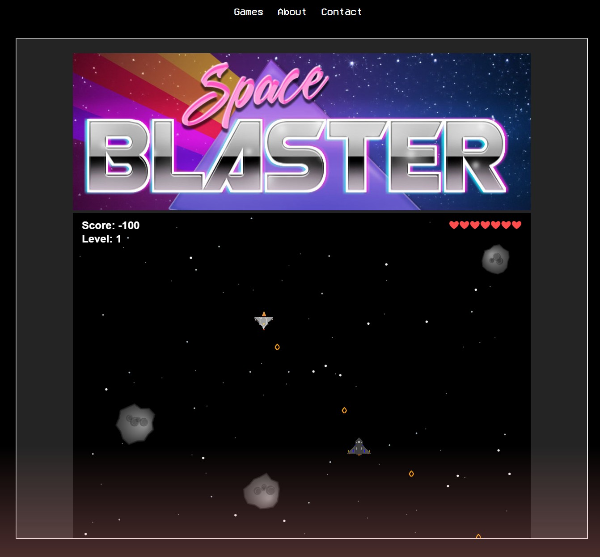

# 🚀 Space Blaster

> **Defend the galaxy. Dodge the asteroids. Blast everything that moves.**

Space Blaster is a retro-style, browser-based shoot 'em up built entirely in TypeScript. Pilot your spacecraft through **10 increasingly brutal levels**, each packed with waves of alien fighters that swarm toward you, shoot back, and get faster the deeper you go. How long can you survive?

---

## 🎮 [▶ Play Now!](https://lemon-tree-0c758d303.4.azurestaticapps.net/spaceblaster.html)

No installation. No downloads. Just open the link and start blasting.

---

## 📸 Screenshots



_The calm before the storm — enemies closing in, bullets flying, stars streaming past._

---

## 🕹️ Controls

Master these moves and you might just make it out alive:

| Key             | Action                         |
| --------------- | ------------------------------ |
| `←` Arrow / `A` | Move left                      |
| `→` Arrow / `D` | Move right                     |
| `↑` Arrow / `W` | Thrust forward (up the screen) |
| `↓` Arrow / `S` | Pull back (down the screen)    |
| `Space`         | **Fire!**                      |

**Pro tips:**

- Watch your ship bank when strafing left or right — style _and_ function.
- Destroy asteroids for a **200 point bonus** each.
- Getting hit costs you **100 points** and a life — you start with 10 ❤️, so don't get greedy.
- Enemy fire gets faster every level. Levels 8, 9, and 10 are not messing around.

---

## 👾 What to Expect

- **10 levels**, each with **5 waves** of enemies that advance toward you.
- Two enemy ship types that strafe, swarm, and shoot.
- Tumbling **asteroids** that add chaos to every wave.
- A procedurally generated **chiptune soundtrack** and punchy sound effects.
- A scrolling **star field** that makes you feel like you're actually flying through space.
- A glorious **GAME OVER** screen (hopefully you won't see it too soon).

---

## 🛠️ Tech Stack

- **TypeScript** — The whole game is strongly typed, from sprites to the game loop.
- **HTML5 Canvas** — All rendering is done on a 1280×720 canvas via the 2D context API.
- **Web Audio API** — Synthesized music and sound effects, no audio files required.
- **Vite** — For fast development builds and bundling.

---

## 🔧 Running Locally

```bash
npm install
npm run dev
```

Then open `http://localhost:5173` in your browser.

---

## 🧠 How the Game Loop Works

The heart of Space Blaster lives in [`src/GameLoop.ts`](src/GameLoop.ts). Here's a walkthrough of the key mechanics:

### `requestAnimationFrame` — The Heartbeat

```typescript
public render = () => {
    window.requestAnimationFrame(this.render.bind(this));
    // ...
}
```

The entire game runs inside a single `render()` method that schedules itself recursively using `requestAnimationFrame`. This ties the game to the browser's display refresh rate (typically 60 fps), giving smooth animation without a manual timer. Every frame: clear the canvas, update positions, detect collisions, draw everything, repeat.

### Clearing and Redrawing

```typescript
private clearCanvas = () => {
    this.ctx.fillStyle = "black";
    this.ctx.fillRect(0, 0, this.ctx.canvas.width, this.ctx.canvas.height);
}
```

Rather than partially erasing sprites, the canvas is completely repainted black every frame. The scrolling star field is recreated by moving each `Star` sprite slightly down the screen each tick, giving the illusion of forward motion through space.

### Keyboard Input Polling

The `KeyboardInput` class maps key codes to callbacks. On each frame, `startInputLoop()` is called which iterates every registered key and fires its callback if the key is currently held down:

```typescript
public startInputLoop = (): void => {
    for (var key in this.keyDown) {
        if (this.keyDown[key]) {
            this.keyCallback[key]?.();
        }
    }
}
```

This polling approach means movement is continuous while a key is held — the player ship smoothly flies as long as you keep the key pressed.

### Collision Detection

Each frame, `detectCollisions()` asks the current `Level` to check whether any enemy bullet or enemy ship has overlapped with the player, and whether any player bullet has hit an enemy or asteroid. The result is a `CollisionSummary` object:

```typescript
interface CollisionSummary {
  enemiesDestroyed: number;
  enemyScoreGained: number;
  asteroidHits: number;
  asteroidsDestroyed: number;
  playerHit: boolean;
}
```

Scoring, lives, and sound effects are all driven by this summary. Getting hit deducts 100 points and a life; destroying an asteroid earns 200 points.

### Level and Wave Progression

Each level (`LevelOne`) contains an array of `Wave` objects. Waves advance one at a time — once all enemies in a wave are destroyed or move off-screen, a short transition delay fires before the next wave begins. After all 5 waves complete, `LevelOne` marks itself as `completed`, and the `GameLoop` loads the next level (up to level 10), increasing enemy bullet speed and reducing their shoot cooldown each time.

### The HUD

The score, current level, and remaining lives are rendered directly onto the canvas every frame using the 2D context text API:

```typescript
private renderHud = () => {
    this.ctx.fillText(`Score: ${this.score}`, 20, 36);
    this.ctx.fillText(`Level: ${this.currentLevelNumber}`, 20, 66);
    this.ctx.fillText(`${"❤".repeat(this.lives)}`, this.ctx.canvas.width - 20, 36);
}
```

Lives are displayed as a row of hearts that shrinks as you take damage — a simple but satisfying way to feel every hit.
